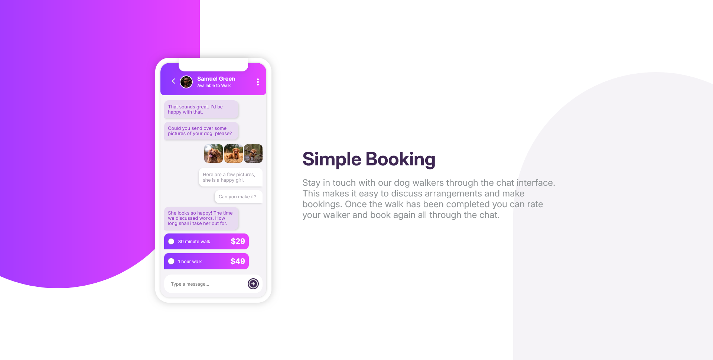
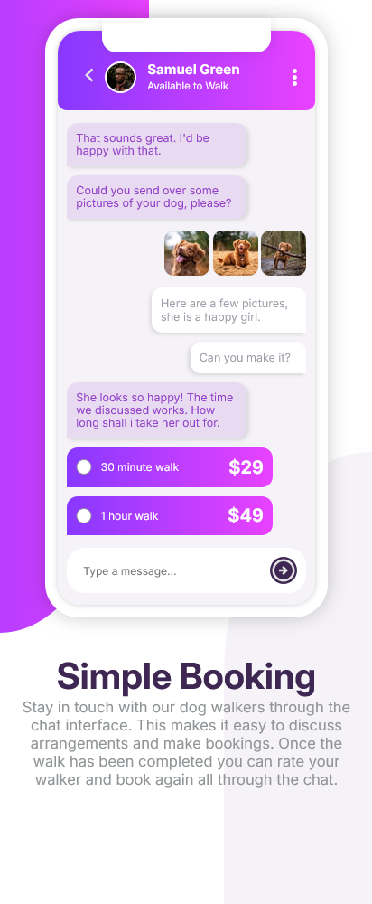

# Frontend Mentor - Chat app CSS illustration solution

This is a solution to the [Chat app CSS illustration challenge on Frontend Mentor](https://www.frontendmentor.io/challenges/chat-app-css-illustration-O5auMkFqY).
Frontend Mentor challenges help you improve your coding skills by building realistic projects.

## Table of contents

* [Overview](#overview)

  * [The challenge](#the-challenge)
  * [Screenshot](#screenshot)
  * [Links](#links)
* [My process](#my-process)

  * [Built with](#built-with)
  * [What I learned](#what-i-learned)
  * [Continued development](#continued-development)
* [Author](#author)
* [Acknowledgments](#acknowledgments)

---
 
## Overview

### The challenge

Users should be able to:

* View the optimal layout for the component depending on their device's screen size
* **Bonus:** See the chat interface animate on the initial load

### Screenshot

#### Desktop Design



#### Mobile Design



### Links

* **Solution URL:** [https://github.com/ftsomesh/chat-illustration](https://github.com/ftsomesh/chat-illustration)
* **Live Site URL:** [https://ftsomesh.github.io/chat-illustration](https://ftsomesh.github.io/chat-illustration)

---

## My process

### Built with

* **Semantic HTML5** markup
* **CSS custom properties**
* **Flexbox** for layout
* **Desktop-first** workflow
* **Responsive design** with media queries
* **Gradient backgrounds** and subtle shadows for a clean modern look

---

### What I learned

This project helped me strengthen my understanding of **responsive design** and **visual composition** using gradients and Flexbox.
I also practiced creating a **mock mobile chat interface** purely with HTML and CSS, focusing on hierarchy, spacing, and subtle details.

Some specific learnings include:

```css
/* Using linear-gradient for smooth background transitions */
.gradient-bg {
      --linear-background: linear-gradient(to left, hsl(293, 100%, 63%), hsl(264, 100%, 61%));
}


```

And a neat HTML snippet I’m proud of:

```html
 <div class="three-button-navigation">
  <span class="circle-nav"></span>
  <span class="circle-nav"></span>
  <span class="circle-nav"></span>
  </div>
```

---

### Continued development

In future projects, I’d like to:

* Add **simple animations** to the chat messages on load
* Experiment more with **CSS clip-path** and **shapes** for creative backgrounds
* Focus more on **accessibility** and better **HTML structure** for screen readers

---

## Author

* **Website:** [Somesh Sahu](https://ftsomesh.github.io/somesh2hsl)
* **Frontend Mentor:** [@ftsomeshh](https://www.frontendmentor.io/profile/ftsomeshh)
* **Twitter:** [@ftsomeshh](https://www.twitter.com/ftsomeshh)

---

## Acknowledgments

A big thanks to **Frontend Mentor** for the challenge design.
Also, special appreciation to the developer community for sharing helpful CSS gradient ideas and layout inspirations!

---
